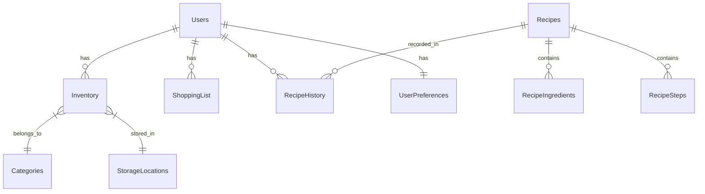

# Schéma de Base de Données (SQLite) - EcoPanier

Ce document propose un schéma relationnel robuste et évolutif pour l'application, conçu pour être facilement implémenté avec SQLite (via Expo SQLite ou une autre librairie).

## 📊 Diagramme Relationnel Simplifié



---

## 🛠️ Définition des Tables (SQL)

### 1. Tables de Référence (Enums/Lookups)

Pour garantir la cohérence des données et éviter les fautes de frappe.

```sql
-- Catégories d'aliments (Fruits, Légumes, etc.)
CREATE TABLE categories (
    id INTEGER PRIMARY KEY AUTOINCREMENT,
    name TEXT NOT NULL UNIQUE,
    icon TEXT, -- Nom de l'icone
    color TEXT -- Code couleur Hex
);

-- Lieux de stockage (Frigo, Placard, etc.)
CREATE TABLE storage_locations (
    id INTEGER PRIMARY KEY AUTOINCREMENT,
    name TEXT NOT NULL UNIQUE
);

-- Unités de mesure (kg, g, L, pièce, etc.)
CREATE TABLE units (
    id INTEGER PRIMARY KEY AUTOINCREMENT,
    code TEXT NOT NULL UNIQUE, -- 'kg', 'g', 'ml'
    label TEXT NOT NULL -- 'Kilogramme', 'Gramme'
);
```

### 2. Inventaire (Cœur de l'application)

```sql
CREATE TABLE inventory_items (
    id TEXT PRIMARY KEY, -- UUID
    name TEXT NOT NULL,
    barcode TEXT,
    quantity REAL NOT NULL DEFAULT 1,
    unit_id INTEGER,
    category_id INTEGER,
    location_id INTEGER,
    expiry_date TEXT, -- Format ISO8601 (YYYY-MM-DD)
    added_date TEXT NOT NULL DEFAULT CURRENT_TIMESTAMP,
    image_url TEXT,
    notes TEXT,
    is_deleted BOOLEAN DEFAULT 0, -- Soft delete

    FOREIGN KEY (unit_id) REFERENCES units(id),
    FOREIGN KEY (category_id) REFERENCES categories(id),
    FOREIGN KEY (location_id) REFERENCES storage_locations(id)
);

-- Index pour accélérer les recherches fréquentes
CREATE INDEX idx_inventory_expiry ON inventory_items(expiry_date);
CREATE INDEX idx_inventory_category ON inventory_items(category_id);
```

### 3. Recettes

```sql
CREATE TABLE recipes (
    id TEXT PRIMARY KEY, -- UUID ou ID Spoonacular préfixé
    title TEXT NOT NULL,
    description TEXT,
    source TEXT DEFAULT 'user', -- 'spoonacular', 'user', 'ai'
    prep_time_minutes INTEGER,
    cook_time_minutes INTEGER,
    servings INTEGER,
    difficulty TEXT CHECK(difficulty IN ('Facile', 'Moyen', 'Difficile')),
    image_url TEXT,
    is_favorite BOOLEAN DEFAULT 0,
    created_at TEXT DEFAULT CURRENT_TIMESTAMP
);

-- Ingrédients nécessaires pour une recette
CREATE TABLE recipe_ingredients (
    id INTEGER PRIMARY KEY AUTOINCREMENT,
    recipe_id TEXT NOT NULL,
    name TEXT NOT NULL,
    quantity REAL,
    unit_id INTEGER,
    is_optional BOOLEAN DEFAULT 0,

    FOREIGN KEY (recipe_id) REFERENCES recipes(id) ON DELETE CASCADE,
    FOREIGN KEY (unit_id) REFERENCES units(id)
);

-- Étapes de préparation
CREATE TABLE recipe_steps (
    id INTEGER PRIMARY KEY AUTOINCREMENT,
    recipe_id TEXT NOT NULL,
    step_order INTEGER NOT NULL,
    instruction TEXT NOT NULL,

    FOREIGN KEY (recipe_id) REFERENCES recipes(id) ON DELETE CASCADE
);
```

### 4. Liste de Courses

```sql
CREATE TABLE shopping_list (
    id TEXT PRIMARY KEY, -- UUID
    name TEXT NOT NULL,
    quantity REAL DEFAULT 1,
    unit_id INTEGER,
    category_id INTEGER,
    is_purchased BOOLEAN DEFAULT 0,
    added_from_recipe_id TEXT, -- Lien optionnel vers la recette source
    created_at TEXT DEFAULT CURRENT_TIMESTAMP,

    FOREIGN KEY (unit_id) REFERENCES units(id),
    FOREIGN KEY (category_id) REFERENCES categories(id)
);
```

### 5. Préférences et Historique

```sql
CREATE TABLE user_preferences (
    key TEXT PRIMARY KEY, -- ex: 'theme', 'language', 'notifications_enabled'
    value TEXT NOT NULL -- Stocké en JSON string si complexe
);

CREATE TABLE recipe_history (
    id INTEGER PRIMARY KEY AUTOINCREMENT,
    recipe_id TEXT NOT NULL,
    cooked_date TEXT DEFAULT CURRENT_TIMESTAMP,
    rating INTEGER CHECK(rating >= 1 AND rating <= 5),
    notes TEXT,

    FOREIGN KEY (recipe_id) REFERENCES recipes(id)
);
```

---

## 💡 Pourquoi ce schéma est-il "Facile à utiliser" ?

1.  **Cohérence (Constraintes)** : L'utilisation de clés étrangères (`FOREIGN KEY`) assure que vous ne pouvez pas avoir un article d'inventaire pointant vers une catégorie qui n'existe pas.
2.  **Flexibilité** : Les tables de référence (`categories`, `units`) permettent d'ajouter de nouvelles options sans modifier la structure de la base de données.
3.  **Performance** : Les index sur les dates d'expiration (`idx_inventory_expiry`) rendent l'affichage du tableau de bord ("À consommer bientôt") instantané, même avec beaucoup d'articles.
4.  **Standardisation** : L'utilisation de UUID (texte) pour les tables principales facilite la synchronisation future avec un backend distant, car les ID peuvent être générés côté client sans collision.

## 🚀 Migration depuis AsyncStorage

Si vous utilisez actuellement `AsyncStorage` (stockage clé-valeur), la migration vers ce schéma SQLite permettrait :

- Des requêtes complexes (ex: "Tous les légumes qui périment dans 3 jours").
- Une meilleure intégrité des données.
- Une gestion plus simple des relations (ex: Recette -> Ingrédients).
